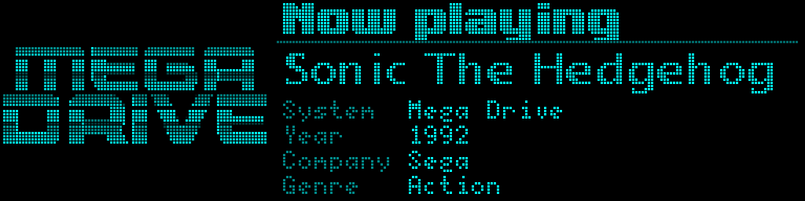
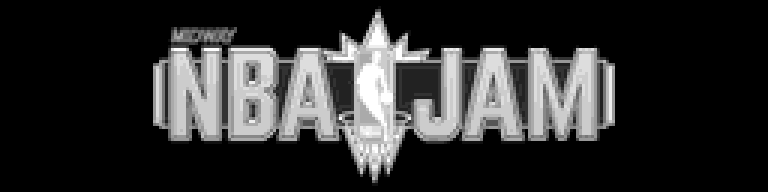
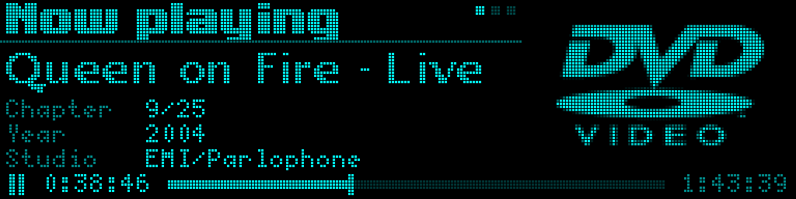
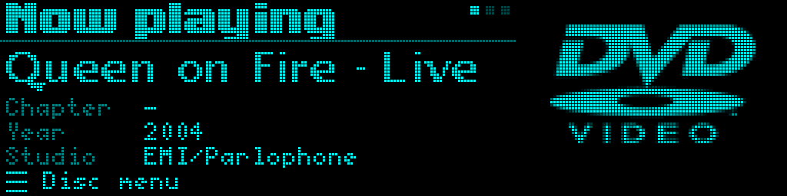
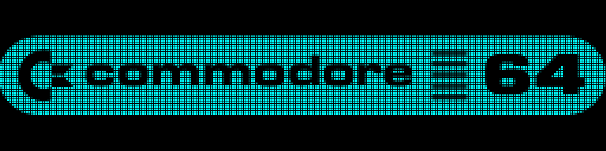

# tty2oled+

*A game-aware OLED display for the **[MiSTer FPGA]**.*

Fork of **[tty2oled]**, adding extra features like game metadata display.

Disclaimer: AI is being used to speed up development of this project.

An SSD1322 OLED panel connects to the MiSTer over USB and shows what you are
playing: artwork for the core, the game's title, the year it came out, who made
it, and — for arcade boards — everything the `.mra` knows. ScummVM's games get
the same treatment, from what ScummVM itself knows about them.


## What is on screen

**Console cores** get a split layout: the title, then the fields you asked for,
with an icon for the system beside them. A title too wide for the column
scrolls; more fields than rows and they take turns, a page every
`METADATA_INTERVAL` seconds (12 unless you change it), the pips by the header
counting the pages - the current one blinking.


Every few minutes the two halves swap sides, so no region of the panel holds
the same lit pixels all day.



A game that [Scrape metadata](#scrape-metadata) imported a description for gets
one more page after its fields: the header, the title and the icon stay, and
the description scrolls slowly up beneath them. When the last line has gone,
the fields come round again.


**Arcade cores** alternate the game's logo with an info card, one step every
`METADATA_INTERVAL` seconds — logo, each page of the card in turn, then the
logo again. The card's top half is the console layout's, across the whole
width: "Now playing", the title — scrolling when it is too long — and a corner
that says Arcade. Below it, the details from the core's `.mra`, two to a row,
and the long ones, like the button names, on a row each. A game that
[Scrape metadata](#scrape-metadata) imported gets its developer and rating
there too, and its description as the card's last page, scrolling up under
the title as a console's does; when the last line has gone, the logo comes
back.




**ScummVM games** get the console layout too. While ScummVM sits on its own
launcher the panel shows the ScummVM banner; start a game and the title comes
up with its year and company, engine, platform, language and series, and the
game's own icon beside them. All of it comes from ScummVM's own files: its
settings say which game was started, and its icon packs hold the details
and a picture for each game. The icon is converted for the panel the first
time a game is played, which takes a few seconds (the ScummVM icon stands in
meanwhile), and is kept after that. Go back to ScummVM's launcher and the
banner returns within ten seconds. The exception is the older Sierra games
(AGI), which give no sign of it, so their details stay up until you pick
another game or quit.


**Films on the DVD core** ([owenb321's MiSTer_DVD](https://github.com/owenb321/MiSTer_DVD))
get the console layout with a DVD beside the details, and a band under both:
a play arrow that flashes while the film plays (two bars when paused, three
lines in the disc's menu), the time in and the film's length either side of
a bar, and the chapter above the details. It works the same for a disc in a
USB drive and for an ISO. What the film is - title, year, studio, director,
the band of a concert - comes from Wikipedia, looked up once per disc by the
disc's label (an ISO by its file name). A disc Wikipedia does not know shows
its label, made readable. The description page is the article's
introduction.






The core reports whether it is playing, paused or in the menu only while
the file `/media/fat/dvd_hil` exists - its developer's test switch - so
tty2oled+ creates it while the DVD core runs and removes it afterwards. Where
in the film you are, the core does not report at all: the display works it
out from where the core is reading the disc, which runs half a minute ahead
of the picture, so a time can be a second or two out for a moment after you
skip.

**Hybrid cores** - [Dethrace](https://github.com/ItsDanik/Dethrace_MiSTer)
(Carmageddon) and [ECWolf](https://github.com/ItsDanik/ecwolf_MiSTer)
(Wolfenstein 3D), games that run on the MiSTer's ARM behind an FPGA core of
their own - are one game each, so loading the core is enough: its banner,
then the console layout with the game's title, who developed it, the year
and publishers, the core and its author, the game's icon beside them and a
description as the last page. What is shown for each is a line of
`hybridcores.txt` in the install folder.

**Computer cores** show the core's artwork full-screen, and nothing else, yet.  
Computer metadata support coming in the future.



**At power-on** the panel says which firmware it is running while it waits for
the MiSTer, with a sweep to show it is alive and waiting. The picture is yours
if you have stored one.


**On the menu** - and on MisterZine, Degauss and Zaparoo - the picture keeps to the
top 54 rows, like the boot screen, and the ten rows under it are for the
display's own messages. That is where it says, small and grey, that an update
is waiting:

- **TTY2OLED+ Update Available** - a newer tty2oled+ is out. Gone once
  **Update** has installed it.
- **System Update Available** - `update_all` would update something you
  have: a new build of a core you use, a changed file, a new Linux. Worked out
  from `update_all`'s own records of what each of its databases installed, so
  a new build of a core your filter leaves out does not count. Gone once
  `update_all` has run.
- **TTY2OLED+ & System Update Available** - both.

Both are looked for at boot and every half hour after, in the background, and
each stops being looked for once found. Each can be switched off.


With nothing waiting, the same place shows the **date and time** - the date
at the left, the time at the right, in the MiSTer's own time zone. Both
formats are settings (`BAND_CLOCK_LEFT`, `BAND_CLOCK_RIGHT`, any `strftime`
format), and it can be switched off. An update notice takes its place while
one waits, and the busy bar while an update runs.


And it takes turns with a **news ticker**: after 30 seconds the date and time
fade out and the headlines of an RSS feed scroll through that row for a
minute - by default [MisterZine's list](https://misterzine.fyi/releases/) of
new and updated cores and arcade games - then the date and time fade back in.
The headline on the panel when the minute is up is let finish first, and the
next run carries on with the one after it. The feed (`RSS_URL`, RSS or Atom),
both times (`RSS_CLOCK_SECS`, `RSS_SCROLL_SECS`), the speed and how often the
feed is read are settings; `RSS_FEED="no"` switches it off. While an update
is waiting the row says so instead, and no headlines run.

**While MiSTer SAM plays** games by itself, the header above a game's details
reads "Super Attract Mode" instead of "Now playing", with the time left until
SAM moves on to its next game after it, counting down.


**While an update runs** the panel says so instead of leaving stale artwork up,
whether it is `update_all`, MiSTer's own updater (`update.sh` - what
Zaparoo's Update runs) or tty2oled+ updating itself. Under the message, in
small grey letters, is what the update is doing right now - for `update_all`
and `update.sh` the last line it printed, for tty2oled+ each step,
including a warning just before the display's firmware is flashed. Those
screens arrive with the same transition everything else uses; the bar that
runs during the download simply appears, since by then nothing is being
replaced.


When it has finished the message becomes **Update Complete** (or **Update
Failed**) and stays at least three seconds before the core's picture comes
back.


Pictures cross-fade by default, and the panel dims itself after a couple of
minutes of nothing happening, waking on the next thing the MiSTer sends.

## What you need

- A **tty2oled display with an ESP32** — classic ESP32 or S3 — driving an
  SSD1322 256x64 panel, in **USB mode**. (An ESP8266 has too little RAM for
  the game display; the SD and Standard sketch variants are not covered.)
- A MiSTer that is **online**, for the install.

The hardware and wiring are tty2oled's, unchanged: an ESP32 display built for
the original works here as it is. To build one, follow tty2oled's
**[wiring guide]**.

## Installing

1. Download **[tty2oledplus_install.sh]** from the latest release.
2. Copy it to `/media/fat/Scripts` on the MiSTer's SD card — over the network
   share, over FTP, or with the card in your computer.
3. On the MiSTer: **Scripts → tty2oledplus_install**.
4. **Reboot.** MiSTer only reads the setting the installer changed at boot.

The installer fetches the newest release and checks every file against the
release's checksums. Then it:

- installs the scripts, the title index, the system icons and the core artwork
  into `/media/fat/tty2oledplus`
- asks the display which board it is and flashes the matching firmware — only
  when the display is running a different version, and never by guessing
- sets `log_file_entry=1` in the `[MiSTer]` section of `MiSTer.ini`, which is
  what makes MiSTer report the loaded game, and remembers what was there before
- starts the display, and adds the line to `/media/fat/linux/user-startup.sh`
  that starts it on every boot
- leaves one entry in the Scripts menu, **tty2oledplus**, and removes itself

**Over SSH**, instead of the Scripts menu, it is one line:

```sh
curl -fsSL --cacert /etc/ssl/certs/cacert.pem \
  https://github.com/ItsDanik/MiSTer-tty2oled-plus/releases/latest/download/tty2oledplus_update.sh | bash
```

If you want to manally name it the board:
`... | bash -s -- --board lolin32` (or `esp32de`, `esp32s3`).

### Beside the original tty2oled

tty2oled+ lives in its own folder, `/media/fat/tty2oledplus`, and leaves an
original tty2oled in `/media/fat/tty2oled` exactly where it is. Both can be
installed; only one can have the display, because there is one serial port
and each needs its own firmware on the ESP32.

Installing tty2oled+ therefore stops the original's daemon and comments out
its line in `/media/fat/linux/user-startup.sh`, under a note saying so, and
puts its own line at the top. To go back to the original, edit that file:
comment out the `tty2oledplus/S60tty2oled` line, uncomment the
`tty2oled/S60tty2oled` one, and flash the original's firmware. To return,
swap the two again and run **Update**, which sees the other firmware on the
display and flashes tty2oled+'s. An update never undoes your choice in that
file: while the tty2oled+ line is commented out, the original's is left alone.

Which firmware is on the display is yours to keep in step with the line you
enabled. The original is not supported here beyond staying out of its way;
running its own updater may start its daemon beside this one, and tty2oled+
will not start while the original's is running. Uninstalling tty2oled+ puts
the original's line back if the installer was what switched it off.

### The Scripts menu entry

**Scripts → tty2oledplus** opens a menu you can drive with a pad — arrows and
one button:

- **Settings** — what the display shows, see [Settings](#settings)
- **Update** — install the newest release
- **Scrape metadata** — import the game details your scraper already
  found, see [Scrape metadata](#scrape-metadata)
- **Uninstall** — remove it all again

They live in `/media/fat/tty2oledplus` beside everything else, so your
Scripts folder carries one line of ours rather than four. An install from
before 0.6.3b had them as three separate entries, and updating replaces them
with this one - except **tty2oledplus_update**, which the old updater puts
back on its way out and which goes at the next reboot.

With `fb_terminal=0` in `MiSTer.ini` there is no screen to draw a menu on, so
the entry runs **Update** straight away.

### Updating

**Scripts → tty2oledplus → Update.** Your `tty2oled-user.ini` and
`coretypes.ini` are never overwritten, The firmware is flashed on every release,
but the custom boot image is kept.

### Uninstalling

**Scripts → tty2oledplus → Uninstall.** It asks twice before it
does anything — whether to go on, and what to do with the files that are yours
rather than ours — with arrows and one button, no typing.

Choosing **Keep them** copies your settings (`tty2oled-user.ini`,
`coretypes.ini`), the banners in `pics/user`, your `pics/boot.png` and what
Scrape metadata found (`scraped/`) into
`/media/fat/tty2oledplus-saved` before the rest goes. **Cancel** on that
question stops the whole thing.

Then it stops the display, removes the install folder, the start line in
`user-startup.sh` and its Scripts entry, clears any boot image stored on the
display, and puts `MiSTer.ini` back as it found it. The display's firmware is
left alone.

`--yes` skips both questions, `--dry-run` only lists what would go. With
`fb_terminal=0` there is no screen to ask on, so it refuses rather than
guessing — run it with `--yes` if that is what you meant.

[Skraper]: https://www.skraper.net
[tty2oledplus_install.sh]: https://github.com/ItsDanik/MiSTer-tty2oled-plus/releases/latest/download/tty2oledplus_install.sh

## Where the game details come from

The title comes from the filename. The year, publisher, genre and developer come
from an index that is installed with everything else — built from
**[libretro-database]**, offline, no API key and no account. MiSTer writes the
loaded ROM's CRC32 (or a disc serial) to `/tmp/GAMEID`, and that is the key; a
miss costs only the extra fields, and the title still shows.

| Systems | What you get |
|---|---|
| 27 cartridge systems — NES, SNES, Mega Drive, Game Boy and Advance, N64, Master System, TurboGrafx-16, the Ataris, and more | title, region, year, publisher, genre, developer |
| Neo Geo | title, year, publisher — from the MAME set, it being arcade hardware |
| PlayStation, Saturn, Mega CD, 3DO, PC Engine CD | title and region only |
| ScummVM | title, year, company, series, engine, platform, language — and each game's own icon |
| Hybrid cores (Dethrace, ECWolf) | title, developer, year and publishers, core, author, a description — and the game's icon |

Disc systems are a limit of the source: the
cartridge metadata sets carry release dates and publishers, and the disc set
carries neither.

Arcade cores do not use the index at all — everything on the card is read
straight out of the `.mra` file the core was started from. Nor do ScummVM
games: their details come from ScummVM itself — its settings say which game
is running, on which platform and in which language, and its icon packs
(`gui-icons-*.dat`, already on your SD card) carry its games list and a
picture for each game.

Films on the DVD core come from Wikipedia: the first time a disc is played,
its label - `QUEEN_ON_FIRE_AT_THE_BOWL`, made readable - or an ISO's file
name is searched for, and the article's infobox gives the year, studio (or
record label), director and band, its introduction the description. The
answer is kept in `scraped/DVD.txt`, one disc a line, so each disc is asked
about once. A wrong guess can be corrected there by hand - the line's fourth
field is the title, and a correction is never overwritten; a disc nobody
knew is asked about again after 30 days. The chapters and times come from the
disc itself, read once and kept in `cache/dvd`.

Cores are named on screen the way your MiSTer menu names them, from `names.txt`
if you have one.

## Scrape metadata

**Scripts → tty2oledplus → Scrape metadata** gives your games the details a
filename cannot: the number of players, a rating, the release date, the
series, and a description for the [description page](#what-is-on-screen).
Where the index above has nothing — the disc systems' year and publisher — it
fills that in too.

It reads them from a `gamelist.xml`: the file **[Skraper]**, ES-DE, Batocera
and Skyscraper write when they scrape. Put it in the system's own games
folder, beside the games it describes —

```
/media/fat/games/NES/gamelist.xml
/media/usb0/games/SNES/gamelist.xml
/media/fat/games/mame/gamelist.xml
/media/usb0/games/ScummVM/gamelist.xml
```

— then tick the systems and **Import**. **Select all** and **Select none**
are the buttons beside it, and the choice is remembered for next time. No
account, no network: the scraping was done elsewhere, this only reads what it
wrote. Of the consoles, only those with an icon are offered, since their
description page is part of the split layout. **Arcade** is always offered:
its gamelist is the one in `games/mame`, beside the zips, and games are
matched by MAME set name, the `<setname>` in each `.mra`. The `.mra`'s own
year, maker and players win over the gamelist's; the gamelist adds the
developer, the rating and the description. **ScummVM** is always offered
too: its gamelist is the one in `games/ScummVM`, and a game is matched by its
folder's name ("Full Throttle (CD DOS)") or by its ScummVM id (`ft`, as in
`ft.scummvm`).

Games are matched by file name, so the gamelist has to come from the same
ROMs, not renamed since. An import replaces what was there for the games it
lists and leaves the rest alone, so importing again after re-scraping is
safe. What it imports lands in `/media/fat/tty2oledplus/scraped/`, one file
per system, and no update touches that folder.

**With Skraper**, point it at the MiSTer's `games` folder over the network,
choose the EmulationStation / Batocera / Recalbox output so it writes
`gamelist.xml` into each system's folder, and untick every image and video —
only the text is used, and media would be thousands of files on the SD card
for nothing. It may not know MiSTer's folder names (`GAMEBOY`, `MegaDrive`,
`TGFX16-CD`…) as systems; set those by hand in the system's settings.

Running Skraper under Wine on Linux, the path GNOME mounts the share at
(`/run/user/1000/gvfs/smb-share:server=…`) has a `:` in it, which a Windows
path cannot. A symlink without one fixes it:

```sh
ln -s "/run/user/1000/gvfs/smb-share:server=192.168.1.206,share=sdcard" ~/mister-sd
```

and then `Z:\home\<you>\mister-sd\games` in Skraper.

**Arcade descriptions without scraping.** A full MAME set is more than
ScreenScraper's daily quota. MAME's own `history.xml` from
[Arcade-History](https://www.arcade-history.com/index.php?page=download) has
descriptions for most arcade games, offline, and a tool in this repository
turns it into the arcade `gamelist.xml` - on a PC, with Python 3.9 or newer,
for exactly the sets in the folder you point it at:

```sh
./tools/history2gamelist.py history.xml /path/to/games/mame -o out
```

Copy `out/gamelist.xml` to `games/mame` on the MiSTer and import **Arcade**.
Clones and export releases get the original game's description rather than
"see the original entry". A description longer than the display keeps (2048
characters, about a minute of scrolling) is shortened to end at a paragraph or
a sentence, and `out/2048.txt` lists those games and how much of each is kept.
Importing it replaces what an earlier Skraper import said about the same
games, developer and rating included.

Over SSH:

```sh
/media/fat/tty2oledplus/tty2oledplus_scrape.py --list-systems
/media/fat/tty2oledplus/tty2oledplus_scrape.py --systems NES,SNES,Arcade
/media/fat/tty2oledplus/tty2oledplus_scrape.py --systems all
```

## Settings

**Scripts → tty2oledplus → Settings.** **Every setting is in
there** — what the display shows, which details appear under a game, how bright
the panel is and when it dims, how one picture replaces the last, what happens
while updates run, and the connection and troubleshooting settings under
*Advanced* — with what each one does written beside it.

From the Scripts menu everything tty2oled+ shows on the TV - its menu,
Settings, Update, Scrape metadata, Boot screen and Uninstall - is drawn in one
look and worked one way: what Update or Uninstall is doing scrolls by as it
happens, under the same sweep bar the display shows while it is busy, and
waits for OK when it has finished.

Settings opens on the TV in the display's own look: cyan on
black, in the fonts the panel uses, drawn at 320x240 so a 15kHz CRT shows all
of it - on a 224-line mode too (640x224), and stretched to the right shape
where a mode's pixels are not square (640x240). Each setting has the control that suits it — a switch, a slider, a
selector, a text field with an on-screen keyboard, a checklist you can put in
order. Move with the d-pad, change a value with left and right, OK for the
exact value or the full list, Cancel to go back; a keyboard's arrows, Enter
and Escape do the same, and its letters type straight into a text field.

**The display follows along while you change things.** Highlight a setting
and the panel shows the screen it belongs to — a sample console game for the
fields, an arcade card, a film, the menu for the clock and the news ticker,
two pictures taking turns for a transition, the update screens — and every
change is on the glass as you make it. Things that really take minutes are
shown sooner: dimming after two seconds, the side swap every eight. The
display goes back to what it was doing when you leave.

Four things are deliberately not offered, because they are not choices: the
baud rate and serial line settings (the firmware is fixed at 115200, so a
different rate can only break the link), and the three paths the installer
sets, which point at files it put there.

Nothing is written until you save, and saving restarts the display so the new
settings are on the panel before you leave the menu. Anything left at its
default is not written at all, so a later release that changes a default is
followed rather than overridden by a value you never chose.

It needs a screen to draw on: from the Scripts menu that means
`fb_terminal=1` in `MiSTer.ini`, which is the default. Over SSH there is no
screen, and the same settings are offered as plain menus instead (no preview
there); `--dialog` asks for those anywhere:

```sh
/media/fat/Scripts/tty2oledplus.sh settings
```

The same works for the other two — `tty2oledplus.sh update`, `tty2oledplus.sh
uninstall` — with their options after the name.

### The files underneath

Two files, both in `/media/fat/tty2oledplus/`, read in this order:

1. `tty2oled-system.ini` — shipped with the release and **replaced on every
   update**. Do not edit this one.
2. `tty2oled-user.ini` — yours. Never overwritten, and read second, so anything
   in it wins.

So to change something the editor does not cover, put it in the user ini and
restart the display:

```sh
echo 'UPDATE_ALL_POLL="5"' >> /media/fat/tty2oledplus/tty2oled-user.ini
/media/fat/tty2oledplus/S60tty2oled restart
```

The editor writes to the same file, and leaves anything it does not know about
— including your own comments — exactly where it found it.

Settings the display itself acts on — brightness, dimming, side swapping — are
sent over when it restarts, so nothing needs reflashing.

| Setting | Default | Meaning |
|---|---|---|
| `SHOW_METADATA` | `yes` | Master switch. `no` shows core artwork only. |
| `core_bootscreen_time` | `3000` | A console core launched with its game already chosen holds its own full-screen artwork this long, in ms, before the game's details replace it. `0` goes straight to the details. A game loaded into a running core is unaffected. |
| `METADATA_INTERVAL` | `12` | Seconds per page, console and arcade. Arcade: artwork, each card page in turn, then the artwork again. Console: each page of fields in turn. Either way a description page stays until its text has scrolled through. `0` never turns a page. |
| `METADATA_FIELDS` | `System Year Genre Region Format Platform Engine Language Players Rating Released Series` | Which console fields show, and in what order. Four fit at once; the rest take turns, a page every `METADATA_INTERVAL`. Available: System Region Year Company Genre Developer Format Platform Engine Language Players Rating Released Series — Platform, Engine and Language only for ScummVM games, the last four only for games Scrape metadata imported. |
| `METADATA_PINNED` | `System` | Fields that stay put while the rest page under them. The title is always there. |
| `COMPACT_YEAR_COMPANY` | `yes` | Fold the publisher into the year: `1989, Acclaim` on one row. |
| `SHOW_DESCRIPTION` | `yes` | The description page, for games Scrape metadata imported a description for — console and arcade. |
| `HSCROLL_SPEED` | `25` | How fast a title too long for the screen scrolls sideways, in pixels a second. Bigger is faster. |
| `VSCROLL_SPEED` | `6` | How fast a description scrolls up, in pixels a second. |
| `ARCADE_FIELDS` | `Year Manufacturer Players Rating Developer Region Orientation Core Author Set MAME` | Short arcade fields, paired two to a row. Developer, Publisher, Rating, Released and Series come from an imported gamelist. |
| `ARCADE_FIELDS_WIDE` | `Controls Buttons` | Arcade fields whose values need a row of their own. |
| `ARCADE_PINNED` | `Year Manufacturer` | The grid row repeated above each wide page. |
| `CONTRAST` | `255` | Panel brightness, `0`–`255`. |
| `CONTRAST_FADE_MS` | `800` | How long a brightness change takes to fade, `0`–`4000` ms. `0` jumps. |
| `DIM_AFTER` | `120` | Seconds with nothing new on screen before the panel dims. `0` never dims. |
| `DIM_CONTRAST` | `80` | Brightness to dim to, on the same scale as `CONTRAST`. |
| `DIM_FADE_MS` | `6000` | How long going dim takes, `0`–`10000` ms — slow enough not to notice. Waking takes `CONTRAST_FADE_MS`. |
| `DIM_WAKE` | `-1` | Brightness to wake to. `-1` means `CONTRAST`. |
| `FLIP_MINUTES` | `5` | How often the console layout swaps sides, so no part of the panel stays lit. The swap uses `TRANSITION`. `0` never swaps. |
| `TRANSITION` | `-2` | How one picture replaces the last. `-2` cross-fades, `-1` picks a random wipe each time, `0` none, `1`–`23` one particular wipe, `30`–`39` a cross-fade that also slides the picture — the system ini and the settings editor list all of them by name. |
| `TRANSITION_FADE_MS` | `800` | With `-2`: each fade, out and in. `0`–`4000` ms. |
| `TRANSITION_BLANK_MS` | `1000` | With `-2`: how long the panel stays black between them. `0`–`4000` ms. |
| `BOOTSCREEN_AS_MENU` | `yes` | The boot screen doubles as the menu's picture. `no` shows the artwork pack's `MENU` picture instead. |
| `UPDATE_ALL_SCREEN` | `yes` | Say so on the panel while `update_all` or MiSTer's own `update.sh` runs. |
| `UPDATE_ALL_TEXT` | `Updating System ...` | What it says while the download is running. |
| `UPDATE_ALL_DETAILS` | `yes` | Under that, the last line the updater printed. |
| `UPDATE_DONE_TEXT` | `Update Complete` | What the message becomes when an update has finished. |
| `UPDATE_FAILED_TEXT` | `Update Failed` | ...or when it reported errors. |
| `UPDATE_DONE_SECS` | `3` | The least time that stays up before the core comes back. `0` skips it. |
| `SELF_UPDATE_SCREEN` | `yes` | The same, while tty2oled+ updates itself. |
| `UPDATE_CHECK_TTY2OLED` | `yes` | Look for a newer tty2oled+ release. |
| `UPDATE_CHECK_SYSTEM` | `yes` | Look for something `update_all` would update. |
| `UPDATE_CHECK_MINUTES` | `30` | How often to look for both, besides once at boot. `0` never looks. |
| `UPDATE_NOTE_TEXT` | `TTY2OLED+ Update Available` | What the menu, MisterZine, Degauss and Zaparoo say under their picture when a newer tty2oled+ is out. |
| `UPDATE_NOTE_SYSTEM_TEXT` | `System Update Available` | ...when `update_all` has something to update. |
| `UPDATE_NOTE_BOTH_TEXT` | `TTY2OLED+ & System Update Available` | ...when both are waiting. |
| `ROTATE` | `no` | Turn the whole display 180°. |
| `USE_NAMES_TXT` | `yes` | Name cores as your MiSTer menu names them. |
| `PRIORITIZE_USER_BANNERS` | `yes` | Look in `pics/user` before the shipped banners and arcade logos, so a picture you put there replaces the shipped one. `no` searches the shipped artwork first. |
| `GAME_ROOTS` | SD, `usb0`–`usb7`, `cifs` | Where your games live, searched in order. |

`coretypes.ini`, in the same folder, says which cores are consoles, which are
computers and which are arcade. It is only installed when you do not already
have one, so anything you add to it survives an update.

## Making it yours

### A boot screen of your own

The boot screen lives in the display's own flash, so it appears with the MiSTer
switched off or the SD card out. It is **256x54**, not the full 256x64: the
bottom ten rows are the firmware's, where it prints the build version and runs
the sweep.

Converting a picture needs `png2gsc.py` from this repository, which runs on
your computer; storing it is done on the MiSTer:

```sh
./tools/png2gsc.py --boot splash.png          # on your computer -> splash.gsc

/media/fat/tty2oledplus/tty2oled-bootimg.sh set splash.gsc    # on the MiSTer
/media/fat/tty2oledplus/tty2oled-bootimg.sh status            # what is stored
/media/fat/tty2oledplus/tty2oled-bootimg.sh clear             # back to the built-in one
```

Storing one takes a few seconds and no reflash.

**The easy way, with no workstation at all:** put a PNG at
`/media/fat/tty2oledplus/pics/boot.png` and run **tty2oledplus → Settings → Boot
screen → Use my pics/boot.png**. It converts and stores it for you, and the
same menu puts the built-in logo back.

Draw it **256x54** in up to 16 shades of grey — an indexed PNG with a 16-step
greyscale palette converts exactly. Anything else is scaled to fit and centred
on black, so it still works, just not pixel for pixel. The bottom ten rows of
the panel are not yours: that is where the firmware runs its sweep and prints
the build version, whatever picture is stored.

`pics/boot.png` is yours and stays put — no update touches it, so after a
reflash the same menu entry sends it again.

### Artwork

All of it lives under `/media/fat/tty2oledplus/pics/`, one kind per folder:

| folder | what | size |
|---|---|---|
| `pics/banner` | console and computer core banners — the full-screen picture; the menu's, MisterZine's, Degauss's and Zaparoo's are 256x54 | 256x64 |
| `pics/icon` | the console icons, for the split layout | 86x64 |
| `pics/arcade` | the arcade games' wheel logos, packed: `wheels.bin` and `wheels.idx` | 256x64 |
| `pics/user` | **yours** | 256x64 |
| `pics/boot.png` | **yours** — the boot screen, see below | 256x54 |

The first three are the release's and are replaced by every update. `pics/user`
is yours and no update ever touches it — which is what makes it the place to
put a picture of your own, rather than editing `pics/banner` and having the
next release undo it. A file there named after the core — or, for an arcade
game, after its MAME set, `sf2.gsc` — replaces the shipped one
(`PRIORITIZE_USER_BANNERS`, on by default). A picture for the menu,
MisterZine, Degauss or Zaparoo (`zaparoo.gsc`) is 256x54 — their bottom ten rows are the display's —
and a 256x64 one is shown with those rows cut off.

An arcade game is shown by its wheel logo, found by the set name in its
`.mra`: 12235 MAME sets, whose clones and bootlegs share their parent's logo.
They are one file rather than thousands because an SD card stores every file
in a whole cluster: 4621 separate pictures would take about 590MB of a large
card, and packed they take 38MB. A set the pack does not know shows its name
as text.

### Icons

`pics/icon` holds the icon drawn for each system —
27 of them, covering the systems most people play:

> 3DO · Atari 2600 / 5200 / 7800 · Atari Lynx · Game Boy · Game Boy Color ·
> Game Boy Advance · Game Gear · Genesis · Jaguar · Mega CD · Mega Drive ·
> N64 · NES · Neo Geo · PlayStation · Saturn · Master System · SNES ·
> 32X · TurboGrafx-16 · TurboGrafx-16 CD · Virtual Boy · WonderSwan ·
> WonderSwan Color · ScummVM

ScummVM's stands in for a game's own icon until that has been converted,
the first time the game is played.

The hybrid cores, Dethrace and ECWolf, each have their game's.

The twenty console cores without one still get the split layout and everything
in it — just a black panel where the icon would be. To draw your own, work at
**86x64** in sixteen shades of grey, and name the file after the core, as
MiSTer names it, in lower case: `megadrive.gsc`, `gba.gsc`, `nes.gsc` (the
card ignores case, so `MegaDrive.gsc` works too - the release's own are all
lower case).

```sh
./tools/png2gsc.py --out megadrive.gsc megadrive.png
# then copy it into /media/fat/tty2oledplus/pics/icon/
```

Core artwork — the full-screen picture — is **256x64**, named the same way (or
after the MAME set, for an arcade game), and goes in
`/media/fat/tty2oledplus/pics/user/`:

```sh
./tools/png2gsc.py --banner --out megadrive.gsc art.png
```

Either is picked up on the next core change: no flashing and no uploading.

`png2gsc.py` fits and centres a picture on black rather than stretching it,
scaling up as well as down. `--stretch` fills the frame, `--dither` suits
photographs and hurts flat pixel art, and `--invert` is for art drawn
dark-on-light. It uses Pillow if you have it and ImageMagick otherwise.

Everything on this panel is sixteen shades of grey — no colour, no
transparency. Draw in that palette and the conversion is exact.

## Support

If you enjoy this project, you can support my work on [Patreon](https://www.patreon.com/itsdanik).

## Credit and licence

Original project (tty2oled): venice1200
GPLv3, as that is.

Game metadata comes from **[libretro-database]** and the MAME project.

<!----------------------------------------------------------------------------->

[MiSTer FPGA]: https://github.com/MiSTer-devel
[libretro-database]: https://github.com/libretro/libretro-database
[tty2oled]: https://github.com/venice1200/MiSTer_tty2oled
[wiring guide]: https://github.com/venice1200/MiSTer_tty2oled/wiki/Electrical